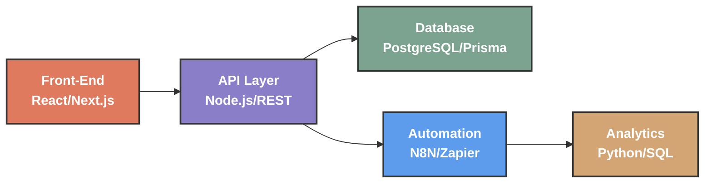

<!-- 
  ███████  █████  █████  ██████  
  ██      ██   ██ ██   ██ ██   ██ 
  ███████ ███████ ██████  ██   ██ 
       ██ ██   ██ ██   ██ ██   ██ 
  ███████ ██   ██ ██   ██ ██████  
-->

<div align="center">
  <picture>
    <source media="(prefers-color-scheme: dark)" srcset="https://capsule-render.vercel.app/api?type=waving&color=0:0d1117,100:2b5f8a&height=300&section=header&text=SAAD&fontSize=120&fontColor=fff&desc=Architecture%20%E2%80%A2%20Automation%20%E2%80%A2%20Kubernetes&descAlignY=60&descSize=20&animation=twinkling" />
    <source media="(prefers-color-scheme: light)" srcset="https://capsule-render.vercel.app/api?type=waving&color=0:667eea,100:764ba2&height=300&section=header&text=SAAD&fontSize=120&fontColor=fff&desc=Architecture%20%E2%80%A2%20Automation%20%E2%80%A2%20Kubernetes&descAlignY=60&descSize=20&animation=twinkling" />
    
  </picture>
</div>

<!-- Elegant Entry -->
<p align="center">
  <a href="https://git.io/typing-svg">
    
  </a>
</p>

<!-- Sacred Geometry Divider -->
<p align="center">
  
</p>

<p align="center">
  <b><code>◈ ⬡ △ ⟁ ◉ ✦</code></b>
</p>

<!-- Main Content Container -->
<div align="center">
  <table align="center" border="0" cellpadding="10" cellspacing="0" style="border-collapse: collapse; border: none;">
    <tr>
      <td width="60%" valign="top" style="border: none;">

### ⟁ Technical Architecture



*<sub>Front-end → API → Database + Automation → Analytics</sub>*

      </td>
      <td width="40%" valign="top" style="border: none;">

### ⟁ Core Competencies

```
╔════════════════════════════╗
║  ▓▓▓▓▓▓▓▓▓▓▓▓▓░░░  90%    ║  Kubernetes
║  ▓▓▓▓▓▓▓▓▓▓▓▓░░░░  85%    ║  Docker
║  ▓▓▓▓▓▓▓▓▓▓▓▓▓▓░░  88%    ║  Node.js
║  ▓▓▓▓▓▓▓▓▓▓▓▓░░░░  82%    ║  React/Next
║  ▓▓▓▓▓▓▓▓▓▓▓▓▓▓░░  86%    ║  PostgreSQL
║  ▓▓▓▓▓▓▓▓▓▓▓░░░░░  78%    ║  Python
║  ▓▓▓▓▓▓▓▓▓▓▓▓▓░░░  84%    ║  Automation
╚════════════════════════════╝
```

### ◉ Current Focus

```python
#!/usr/bin/env python3
# ~/current_focus.py

class Saad:
    def __init__(self):
        self.role = "Architecture Automation Engineer"
        self.team = "@BonoboClub"
        self.location = "Alkmaar, Netherlands"
        self.passion = "Building resilient systems"
    
    def daily_drivers(self):
        return [
            "☸️  Kubernetes orchestration",
            "⚡  Workflow automation",
            "🔷  System architecture",
            "📊  Data pipelines"
        ]
```

      </td>
    </tr>
  </table>
</div>

<!-- Project Showcase with Elegant Cards -->
<h2 align="center">📌 Featured Projects</h2>

<div align="center">
  <table>
    <tr>
      <td align="center" width="200">
        <a href="https://github.com/sa3oud/bonobolab-viz">
          <br />
          <sub>Terminal visualization<br />with custom glyphs</sub><br />
          
        </a>
      </td>
      <td align="center" width="200">
        <a href="https://github.com/sa3oud/k8s-demo">
          <br />
          <sub>Kubernetes orchestration<br />patterns</sub><br />
          
          
        </a>
      </td>
      <td align="center" width="200">
        <a href="https://github.com/sa3oud/face-reading-ai">
          <br />
          <sub>Computer vision<br />face detection</sub><br />
          
          
        </a>
      </td>
    </tr>
    <tr>
      <td align="center" width="200">
        <a href="https://github.com/sa3oud/seoholland">
          <br />
          <sub>iOS app for<br />Dutch market</sub><br />
          
        </a>
      </td>
      <td align="center" width="200">
        <a href="https://github.com/sa3oud/seo-photography">
          <br />
          <sub>Multi-language<br />photography site</sub><br />
          
          
        </a>
      </td>
      <td align="center" width="200">
        <a href="https://github.com/sa3oud/tech-vandaag">
          <br />
          <sub>Tech news<br />static site</sub><br />
          
        </a>
      </td>
    </tr>
  </table>
</div>

<!-- GitHub Analytics -->
<h2 align="center">📊 GitHub Analytics</h2>

<div align="center">
  <a href="https://github.com/sa3oud">
    
    
  </a>
</div>

<!-- Activity Graph -->
<div align="center">
  <a href="https://github.com/sa3oud">
    
  </a>
</div>

<!-- Connect Section with Glassmorphism -->
<h2 align="center">📫 Connect</h2>

<div align="center">
  <table>
    <tr>
      <td>
        <a href="https://github.com/sa3oud">
          
        </a>
      </td>
      <td>
        <a href="https://linkedin.com/in/sa3oud">
          
        </a>
      </td>
      <td>
        <a href="mailto:saad@bonoboclub.io">
          
        </a>
      </td>
    </tr>
  </table>
</div>

<!-- Signature Section -->
<div align="center">
  <br />
  
  
  <h3>
    <code>✦ Architecting the future, one system at a time ✦</code>
  </h3>
  
  <p>
    
  </p>
  
  <sub>
    <b>📍 Alkmaar, Netherlands</b> • <b>Web & Automation Architect</b>
  </sub>
  
  <br />
  <br />
  
  <!-- Visitor Counter -->
  
  
  <br />
  
  <!-- Footer Wave -->
  
</div>
