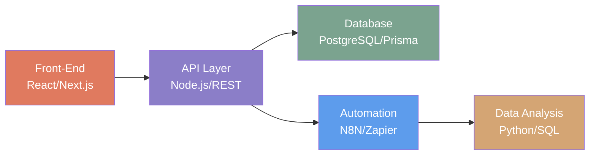

<!-- Simple Header -->
<p align="center">
  <b><code>✦ @BonoboClub •• Previously @Veepee @Youwe ✦</code></b>
</p>

<p align="center">
  <b><code>◈ ⬡ △ ⟁ ◉ ✦</code></b>
</p>

<!-- Main Content Container -->
<div align="center">
  <table align="center" border="0" cellpadding="10" cellspacing="0">
    <tr>
      <td width="60%" valign="top">

### ⟁ Technical Architecture



  

### ⟁ Core Stack

```
╔════════════════════════════╗
║  ▓▓▓▓▓▓▓▓▓▓▓▓▓░░░  90%    ║  Kubernetes
║  ▓▓▓▓▓▓▓▓▓▓▓▓░░░░  85%    ║  Docker
║  ▓▓▓▓▓▓▓▓▓▓▓▓▓▓░░  88%    ║  Node.js
║  ▓▓▓▓▓▓▓▓▓▓▓▓░░░░  82%    ║  React/Next
║  ▓▓▓▓▓▓▓▓▓▓▓▓▓▓░░  86%    ║  PostgreSQL
║  ▓▓▓▓▓▓▓▓▓▓▓░░░░░  78%    ║  Python
║  ▓▓▓▓▓▓▓▓▓▓▓▓▓░░░  84%    ║  Automation
╚════════════════════════════╝
```

### ◉ Current

```
📍 Alkmaar, Netherlands
🏢 Architecture Automation @BonoboClub
🔧 Focus: Kubernetes • Workflow Automation • System Architecture
```

  
  </table>
</div>

<!-- Featured Projects -->
<h2 align="center">📌 Featured Projects</h2>

<div align="center">
  <table>
    <tr>
      <td align="center" width="200">
        <b>✦ BonoboLab Viz</b><br />
        <sub>Terminal visualization with custom glyphs</sub><br />
        <code>Go</code>
      </td>
      <td align="center" width="200">
        <b>☸️ k8s-demo</b><br />
        <sub>Kubernetes orchestration patterns</sub><br />
        <code>K8s</code> <code>Docker</code>
      </td>
      <td align="center" width="200">
        <b>👤 Face-Reading AI</b><br />
        <sub>Computer vision face detection</sub><br />
        <code>Python</code> <code>OpenCV</code>
      </td>
    </tr>
    <tr>
      <td align="center" width="200">
        <b>📱 SEOHolland</b><br />
        <sub>iOS app for Dutch market</sub><br />
        <code>SwiftUI</code>
      </td>
      <td align="center" width="200">
        <b>📸 SEO-photography</b><br />
        <sub>Multi-language photography site</sub><br />
        <code>HTML</code> <code>CSS</code> <code>JS</code>
      </td>
      <td align="center" width="200">
        <b>📰 tech-vandaag</b><br />
        <sub>Tech news static site</sub><br />
        <code>HTML</code>
      </td>
    </tr>
  </table>
</div>


<!-- Connect -->
<h2 align="center">📫 Connect</h2>

<div align="center">
  <a href="https://github.com/sa3oud">
    
  </a>

</div>

<!-- Footer -->
<div align="center">
  <br />
  
  
  <p>
    <b>✦ Architecting the future, one system at a time ✦</b><br />
    <code>◈ ⬡ △ ⟁ ◉ ✦</code>
  </p>
  
  <sub>
    <b>📍 Alkmaar, Netherlands</b> • <b>Web & Automation Architect</b>
  </sub>
  
  <br />
  <br />
  
  
  
  <br />
  
  
</div>


